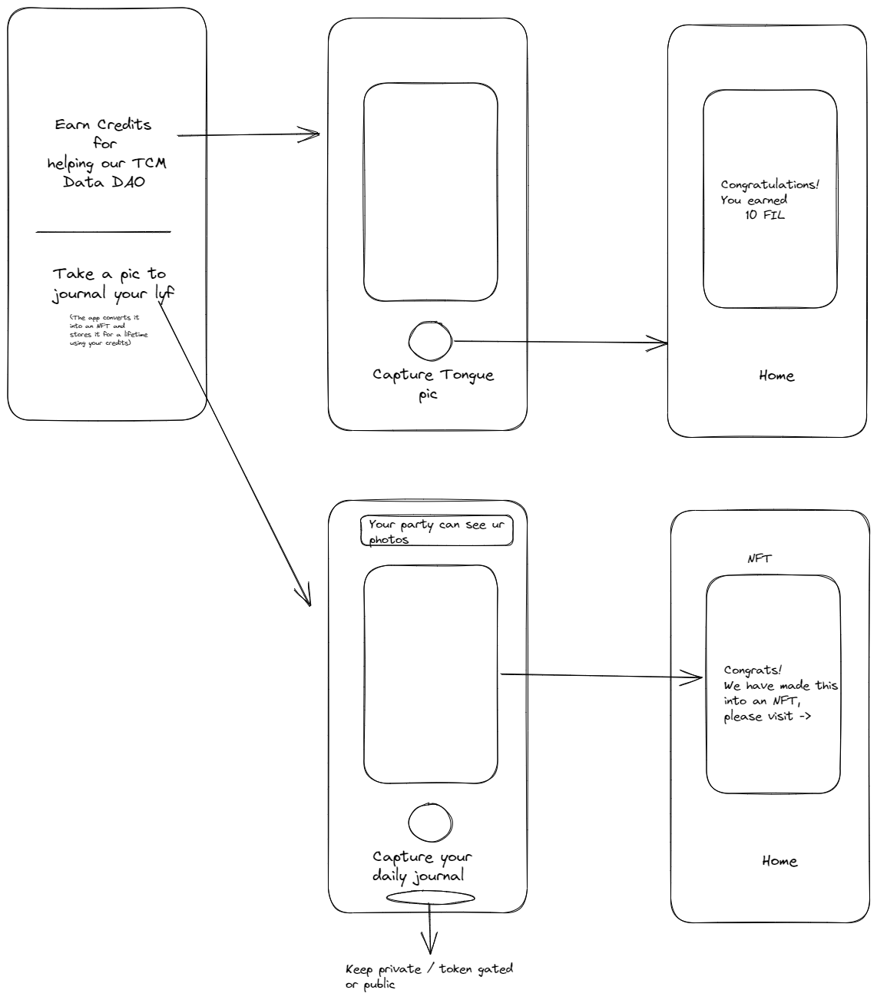

# SoDeFi


This project aims to create a social app to help with a Data DAO around creating a journal for an individual. 
The basic flow is as shown below - 




## Flows - 
1. Allow an end user to upload a file with a unique hash using pinata and create a CID for it.
1. Allow a DAO to vet the file (The DAO to be compensated via credits)
1. If file is good for tongue diagnosis -> Upload the file and pay the user credits
1. Allow the user to upload one file a day for Journey
```markdown
    4a. If user has credits swap this for FIL. 
    4b. Also make it into an NFT with metadata.
    4c. Use the FIL to push and create a deal for long term NFT file storage
    4d. Enable the option to keep the file URI private
```


## Smart Contracts

1. We will need a token for credits (Mintable by the DAO to users who upload tokens, premint 10% for liquidity pools)
2. Deal and fevm contracts