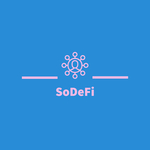
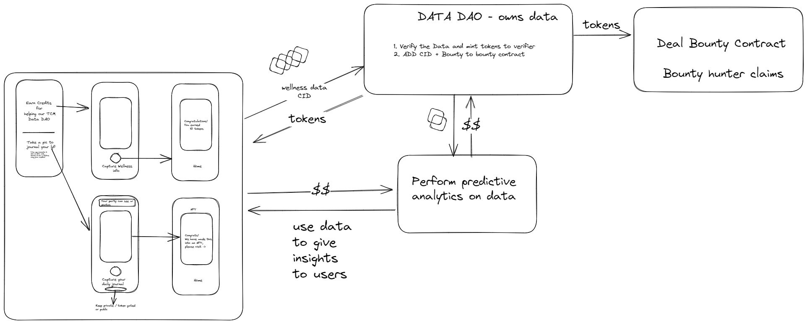

# SoDeFi - Token Gated DataDAO for Wellness



This project aims to create a social app to help with a Data DAO around creating a journal for an individual. 
We enable citizens to journal their wellness and also interesting pics from their daily life.

The wellness data will be used to capture important data points to later train a ML algorithm to predict what you can do better.

The basic flow is as shown below - 



## Flows - 
1. Allow an end user to upload a file with a unique hash using pinata and create a CID for it.
1. Allow a DAO to vet the file (The DAO to be compensated via credits)
1. If file is good -> create a bounty for storage of the CID
1. The DAO to send the user credits if the file is good
1. Allow the user to upload one file a day for Journey
```markdown
    4a. If user has credits swap this for FIL. 
    4b. Also make it into an NFT with metadata.
    4c. Use the FIL to push and create a deal for long term NFT file storage
    4d. Enable the option to keep the file URI private
```

## Smart Contracts

1. WellCoin - We will need a token for credits (Mintable by the DAO to users who upload tokens, premint 10% for liquidity pools)
2. DataDAO - Deal and fevm contracts
3. DAOMember -  NFT membership

### Setup
1. cd packages/fevm-hardhat-kit
1. yarn
1. yarn hardhat deploy

### Testing
1. Deploy contracts
1. Mint NFT to 3 addresses (Guardians)
1. Top up the DataDAO contract with a little FIL(this is to fund the bounty hunters)
1. Get the CID for making the deal
1. Add CID as a guardian 
1. Approve CID as 3 guardians
1. Add to the CID list
1. Make a deal and try to claim bounty

#### hackathon todos
TODO: Allow upload of wellness data to web3.storage encrypted
TODO: see if can do some analysis of the data

#### Foundry < Issue with Foundry deployment switch to hardhat >
1. Clone the folder
2. git submodule update --init --recursive
3. cd packages/foundry && yarn
4. yarn test

### Deployment
1. Deploy in the following order - 
1. DAO membership, token, Data DAO
1. A user uploads an image and gets a CID
1. Next the guardians approve the CID (atleast 2)
1. Any Guardian can create a bounty request, as part of the request the user who uploaded the data gets a reward

### References
We used the https://github.com/lotus-web3/deal-bounty-contract for creating the fevm flows around storage of CID. 